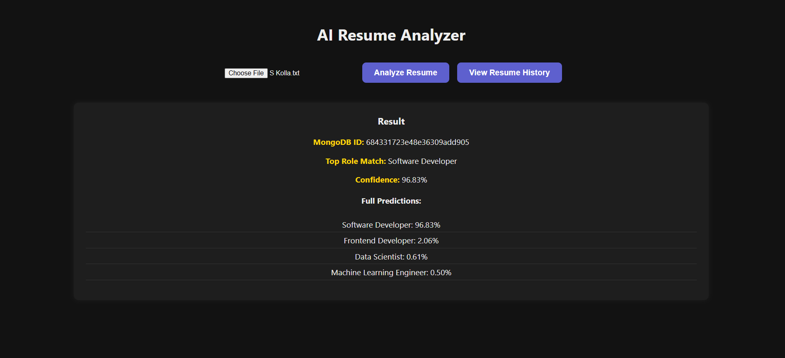
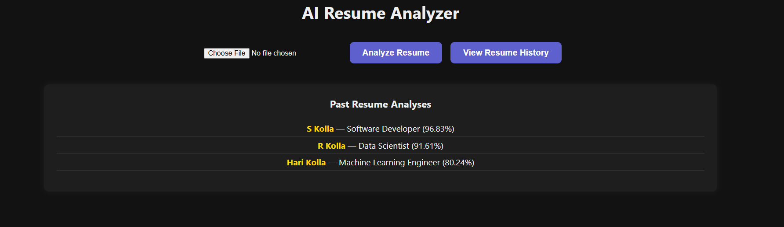

# AI-Powered Resume Analyzer

A full-stack web application that uses **Natural Language Processing (NLP)** to analyze resumes and suggest the most suitable job role. Built using **FastAPI**, **HuggingFace Transformers**, **React.js**, and **MongoDB Atlas**.

---

## Features

-  Upload plain text resumes (`.txt`)
-  Classifies resumes using `facebook/bart-large-mnli` (zero-shot learning)
-  Displays top role match with confidence %
-  Saves each analysis in **MongoDB**
-  View history of past resume uploads with name and results
-  React + FastAPI full-stack architecture

---

## Tech Stack

| Layer       | Tech                             |
|-------------|----------------------------------|
| Frontend    | React.js, Axios, CSS             |
| Backend     | FastAPI, HuggingFace Transformers|
| Database    | MongoDB Atlas (via PyMongo)      |
| ML Model    | `facebook/bart-large-mnli`       |
| Dev Tools   | VS Code, Git, Docker (optional)  |

---

## Project Structure
```
resume_analyzer/
├── backend/
│ ├── main.py       # FastAPI backend logic
│ └── venv/         # Python virtual environment (ignored)
├── frontend/
│ ├── src/          # React components
│ ├── public/
│ └── node_modules/ # Frontend dependencies (ignored)
├── .gitignore
├── README.md
```

---

## Getting Started

### 1. Backend (FastAPI)

```bash
cd backend
# Activate your Python virtual environment
uvicorn main:app --reload
Runs on: http://127.0.0.1:8000
```
### 2. Frontend (React)
```bash
cd frontend
npm install
npm start
Runs on: http://localhost:3000
```
---

## Machine Learning

- **Model**: [`facebook/bart-large-mnli`](https://huggingface.co/facebook/bart-large-mnli)
- **Technique**: Zero-Shot Text Classification
- **Framework**: HuggingFace Transformers
- **Labels Used**:
  - Machine Learning Engineer
  - Software Developer
  - Data Scientist
  - Frontend Developer

> The model determines which role best fits the resume using semantic matching, even if the role wasn't explicitly mentioned.

---

## Example Output

Below is a screenshot showing the result of uploading a resume for analysis.

- The app identifies the candidate’s **top role match** and confidence score.
- It also shows the **full prediction breakdown** for all roles.



- Past resume uploads are listed with the **name extracted from the resume** and role match history.



---

## Deployment & Docker

This project has been **Dockerized** and is **deployed on a cloud platform**.

- Docker ensures consistent environments across development and production
- Deployed using **Render** for smooth CI/CD and scalability
- Uses **MongoDB Atlas** for secure, cloud-based resume data storage

